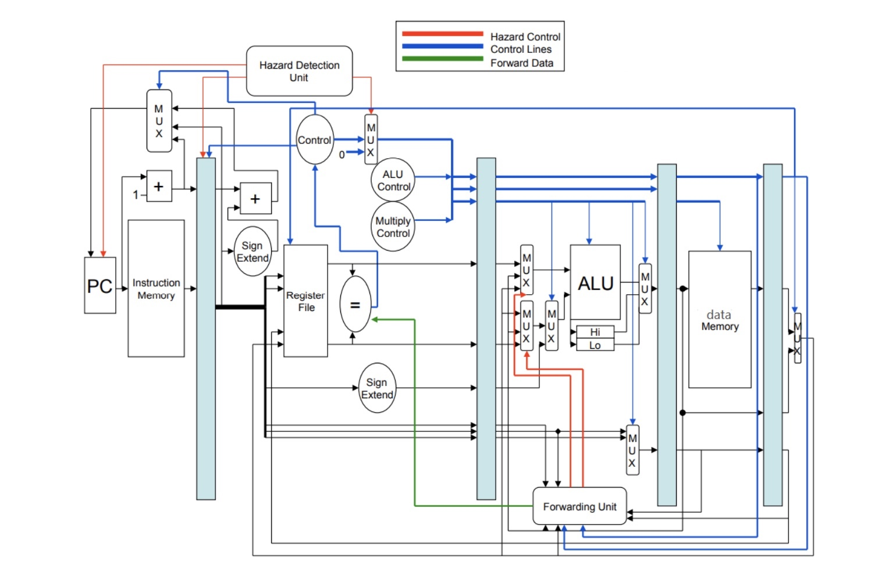

## MIPS PIPELINED CPU

This repository documents the process of building a pipelined CPU following the MIPS instruction set architecture. Starting with the basic building blocks of digital design (adders, muxes, data handlers) all the way to a fully functional simplified MIPS CPU featuring a hazard detection unit, different control signals and a data forwarding unit.