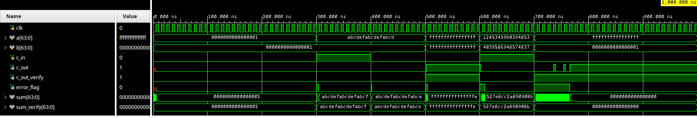
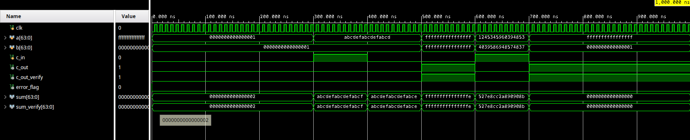
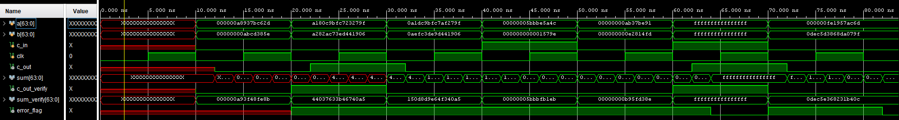
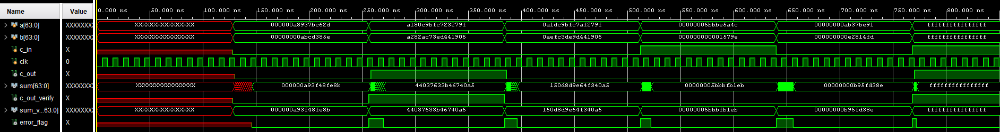


## Carry Select Adder Modules

- ***CSA\_tb.v***: Validates the sum, carry out behavior of CSA.v by assigning values and comparing them for an error.
- ***CSA.v***: Carry Select Adder that runs three 32 bit additions and one 2-1 mux. It computes the overall sum and carry out.
- ***ThTwoBA.v***: 32-bit RCA formed by two sixteen bit RCA blocks.
- ***SteenBA.v***: 16-bit RCA formed by four 4-bit RCA blocks.
- ***FBA.v***: 4-bit adder formed by four 1-bit full adders.
- **FA\_str.v***: Provided one-bit full adder.
- ***HA\_str.v***: Provided one-bit half adder.
- ***MUX.v***: 2-1 multiplexer that chooses one of two 32-bit numbers based on a select bit. This allows the CSA to roughly half its latency.

## Carry Select Adder timing results:

At an FA delay of 1ns, the hardest “add” takes 64 ns (last add/error report in the waveform diagram). This makes sense since the CSA should be half the latency of an equivalent RCA (64 ns vs 128 ns) but it does not include the 2-1 MUX delay since it wasn’t included in the simulation. Otherwise, the rest of the timings are less than 64 ns, which is expected. The timings are expected, though to make it more “realistic” a delay to the MUX could be added. 

Without delay, the circuit works without errors since there are no gate fluctuations:

## Ripple Carry Adder Modules

- ***RCA\_64bit.v***: 64 bit Ripple Carry Adder built using 2 32 bit Ripple Carry Adders.
- ***Verification\_64bits.v***: Validates the 64 bit sum using behavioral Verilog.
- ***RCA\_64bit\_tb.v***: Testbench for 64 bit RCA, validates the sum using the verification, and compares it to the 64 bit RCA result.
- ***RCA\_32bit.v***: 32 bit Ripple Carry adder built using 8 4 bit Ripple Carry Adders.
- ***RCA\_4bit.v***: 4 bit Ripple Carry adder built using 4 Full Adders.
- ***fulladder.v***: Performs 1 bit addition using and, or and not gates

## Ripple Carry Adder timing results

When the gate delay is 0ns, all additions are done instantly so there are no issues updating the input values every 10 ns.

Using a gate delay of 1 ns, I can see an accumulation in the overall time it takes for sum to output the result. This in turn triggers the error flag to high as seen below. This is due to the fact that the testbench periodically modifies the input values for a and b every 10 ns. Since I are using a 64 bit RCA, the largest possible delay is 128 \* 1 ns.

In order to solve this problem, I need to update the frequency at which the values of a and b are changed to 128ns, to account for the longest 64 bit addition.

I notice that when the input values are small, the addition takes less than 128 ns to complete, which explains the instances in which sum is undefined, and the error flag is high.

