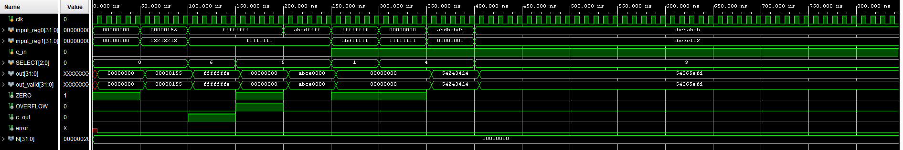

## Modules:

- ***TopModule.v***: Points to both structural and behavioral(verification) ALU & register modules.
- ***TopModule_tb.v***: Computes ALU results and raises theerror flag if both modules output different results.
- ***nbit_ALU.v***: Parametrized generation of the ALU fromthe smaller bALU .v single slice. Handles the zero, carry, and overflow flags.
- ***nbit_ALU_valid.v***: Behavioral implementation of nbit_ALU.v by using 3 to 6 MUX logic.
- ***bALU.v***: Single slice module that acts as a 3 to6 MUX.
- ***nbit_reg.v***: Parametrized generation of a registermade of d flip flops.
- ***bMOV.v***: Mov logic for OpCode: 000.
- ***bNOT.v***: Not logic for OpCode: 001.
- ***bNAND.v***: Nand logic for OpCode: 011.
- ***bNOR.v***: Nor logic for OpCode: 100.
- ***FA_str.v***: Full Adder modules used for both ADD andSUB. With a special case when OpCode is 101 for SUB, c_in = 1 to allow for addition with a second operand as 2’s complement.

## Waveform Diagram:

## Bit Slice Design:

The bit slice design was used across the ALU, and register modules to allow for the parametrization of the input size. This was done with the use of a generate block. Additionally, an N+1 bit wire was used to account for all the carry bits, including the carry_out. This was specifically helpful in the ALU module where c_in needs to be 1 when the OpCode is 101 for SUB.