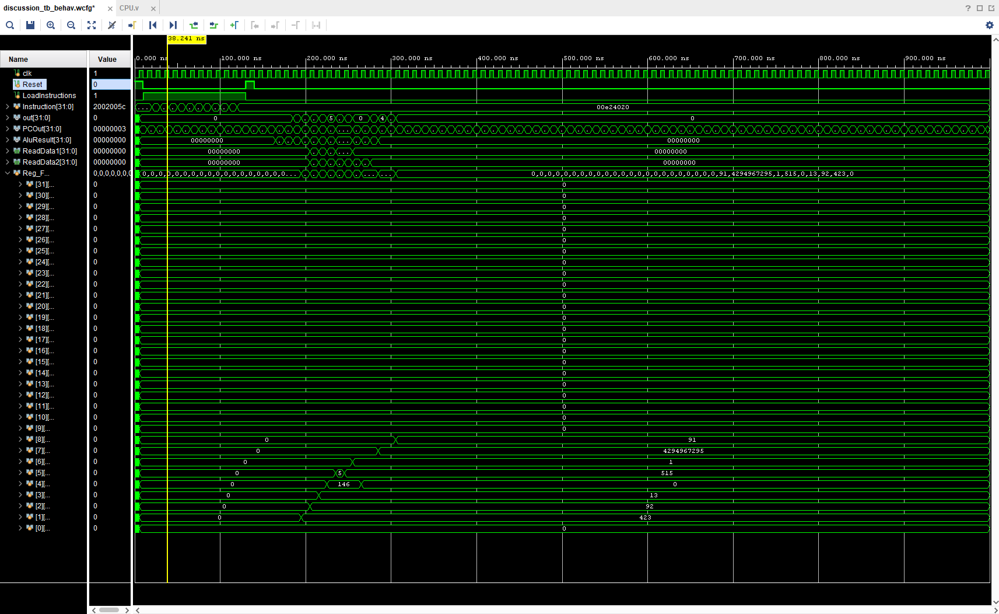
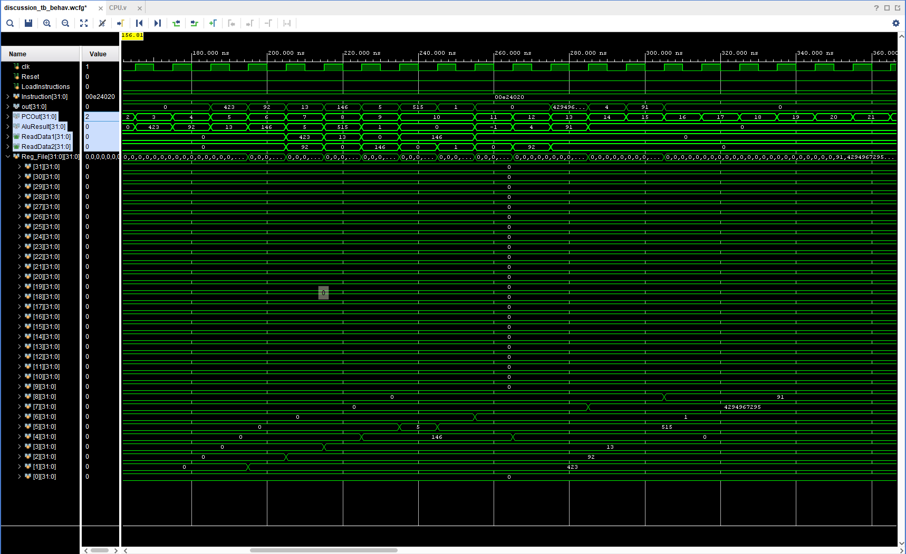

## Modules

- ***hazard_unit.v***: Checks if (memread is enabled AND execution register is equal to the instruction fetch operand or if any of the destinations of the last two instructions is the same as the operand in the present instruction). If this is the case, this is a load use hazard, and a nop is inserted with ({IFIDWrite, PCWrite, HazardMux) = (0,0,1). Otherwise, the program inserts no nop (1,1,0). This way, the CPU implements load-use hazard detection.
- ***forwarding_unit.v***: The outputs of the forwarding unit were sent to the select muxes for the ALU. If the destination register at the beginning of the mem stage was the same as the next instruction’s operand, then that value is forwarded. If the destination register at the writeback stage is similarly the same as the next instruction’s operand, then that value is similarly forwarded by the mux selection. A and B are the two muxes for which the select is chosen. In this manner, all possible dependencies that aren’t load use are forwarded and stalls are prevented. 

## Waveform Diagrams

|  |
|:--:|
| <b>Figure 1: Waveform output for forwarding inserts. Note PC counter and register values.</b>|

|  |
|:--:|
| <b>Figure 2: Closeup of waveform values in relevant space. </b>|

I tested the CPU’s hazard detection ability by using a testbench with one load use hazard in it and several one ahead and two ahead forwarding cases. There was no actual hazard in the final CPU design (load use inserted a nop at PCOut value of 10) and all the results were correct based on the testbench.
