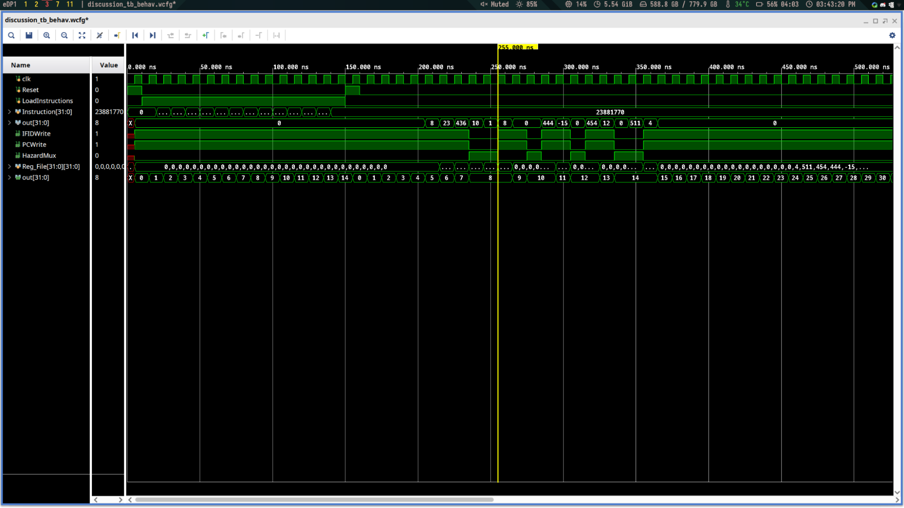
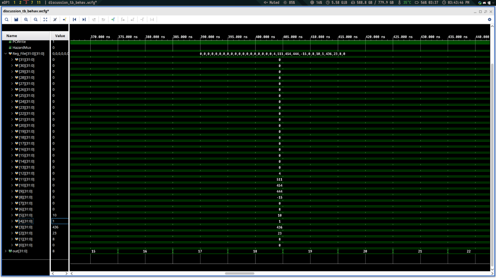

## Modules

- ***Hazardunit.v***: Checks if (memread is enabled AND the last destination operand is the same as any of the present operands) OR if (the destination register of the memory stage is the same as any of the present operands AND MemDest is not 0). If this is true, the program inserts a nop ({IFIDWrite PCWrite, HazardMux) = (0,0,1). Otherwise, the program inserts no nop (1,1,0). This way, the CPU implements load-use, one-ahead, and two-ahead hazard detection.

## Waveform Diagrams

|  |
|:--:|
| <b>Figure 1: Waveform output for the bubble/nop inserts. Note PC counter and IFIDWrite, PCWrite, HazardMUX</b>|

|  |
|:--:|
| <b>Figure 1: Waveform output showing register values after testbench.</b>|

I tested the CPU’s hazard detection ability by using a testbench with four hazards in it. The first hazard was an operation dependent on the instruction immediately before, and the last hazard condition was likewise dependent on the instruction immediately before (OR, SLT). These hazards presented the need for two bubbles to be inserted each, since the requested operand value was not available until two clock cycles after the hazard detection. On the other hand, there were two additional hazards that occurred from dependencies two instructions behind the present instruction (ADD, ADDI). These hazards presented the need for one bubble to be inserted each, since the requested operand value was not available until one clock cycle after the hazard detection.
Therefore, our output waveform in Fig. 1 tracked PC_out to validate the “pause” of the program counter, the CPU output showing the values to be written, and the outputs of the hazard detection unit. The hazard detection unit disables PCwrite and IFIDwrite and enables HazardMux to insert a nop. The complement of that output (1,1,0) allows the pipeline to continue. Note in Fig. 1 that, as expected, the first and last hazards show two nop insertions each (i.e. over two clock cycles) while the second and third hazards show one nop insertion each (i.e. over one clock cycle). Note as well that the associated outputs appear three clock cycles after the nop; this makes sense since the nops are inserted at the beginning of the pipeline and don’t “come out the other end” until three clock cycles later. I also verified that the register values matched the outputs (Fig. 2) and that the outputs matched our manually calculated values for the CPU outputs in the testbench. I found my design is valid for the sample instructions with four hazards. 
