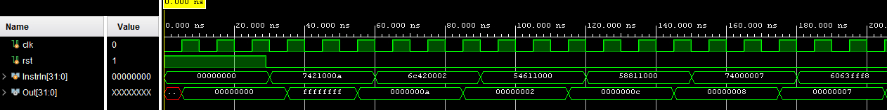
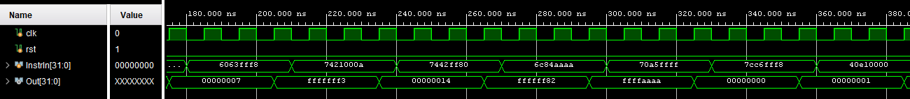
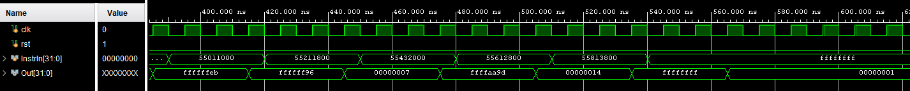

## Modules:

- ***Pipeline.v***: Top module that handles all pipeline register instantiations and validation logic.
- ***Pipeline_tb.v***: Testbench that tests multiple inputs into pipeline to check for hazards.
- ***nbit_ALU.v***: No carry, overflow flags in behavioral implementation of ALU.
- ***nbit_ALU_tb.v***: ALU testbench.
- ***mux.v***: 2-1 multiplexer.
- ***mux_tb.v***: Multiplexer testbench.
- ***nbit_register_file.v***: Register file that stores, writes data, with 2 readselects, 2 readdatas, write select, enable, and write data inputs.
- ***reg_tb.v***: Testbench for the above that compares behaviorally generated values for both.
- ***reg_valid.v***: Generates values from inputs for the nbitregister file that can be compared with the register file for validation.
- ***S1_Register.v***: Register that contains readselect1,2, writeselect, write enable, immediate, data src, and alu OP Code.
- ***S2_Register.v***: Register that contains the same as above.
- ***S3_Register.v***: Register that contains the same as above. Write data is pipelined back to nbit register at this step.

## Waveform Diagrams:

The latency of the instruction (3rd posedge) makes sense given the four staged pipeline. Note that the ALU was written in behavioral verilog, so testing the waveforms would just be confirming that identical programs work.

