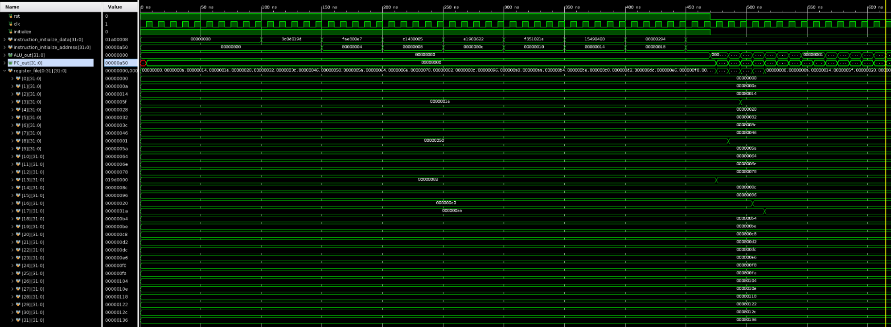
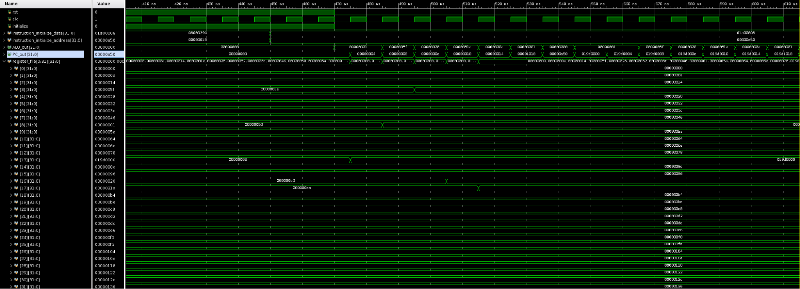
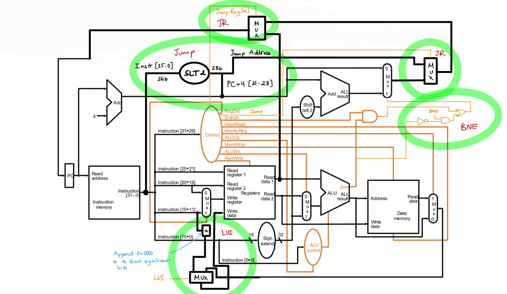

## Modules:

- ***cp.v***: Top CPU module that instantiates all the relevant blocks and the buses. 
- ***tb_cpu.v***: Testbench that tests multiple inputs into cpu to check for hazards. In other words, this loads instructions at specific locations in instruction memory.   
- ***control.v***: Control block that associates opcodes with control signals and outputs them. 
- ***ALU_control.v***: ALU testbench. 
- ***ALU.v***: ALU that handles all sorts of functions (including new arithmetic like SUBI) behaviorally. 
- ***InstrMem.v***: Instruction memory that loads specific instructions into the CPU.
- ***nbit_register_file.v***: Register file that stores, writes data, with 2 readselects, 2 readdatas, write select, enable, and write data inputs. 
- ***PC.v***: Program counter. 		
- ***shift_left_2.v***: Shifts inputs left. 
- ***sign_extend.v***: Sign extends from 16 to 32 bits. 
- ***mux.v***: Is mux.  
- ***memory.v***: Stores data in permanent memory. 	
- ***Adder.v***: General adder that does the plus four. 

## Waveform Diagrams:

|  |
|:--:|
| <b>Figure 1: Waveform output displaying ALU out and register values</b>|

|  |
|:--:|
| <b>Figure 2: Waveform output focusing on the PC_out values</b>|

I tested our CPU by sending it the new instructions (XORI, J, etc.) as well as the old instructions, and comparing manually calculated correct outputs for the register values, ALU outputs and the PC values with the empirical values in verilog. I also tested instructions at specific addresses in instruction memory to test if jumps to those memory addresses would result in the execution of the instruction contained at that memory address.    

## Modified Datapath

For each additional instruction to be supported, new blocks needed to be added. Notably, J, JR, BNE, and LUI got their own blocks in the program to be run. BNE logic could have been done in the ALU, but for simplicity, the block was attached to the branch AND block and the branch direction was determined by the OR gate that detects whether either branch or BNE is triggered. We also added logic for the jump instruction address to extend to 32 bits (26 + 2 + 4) and extra logic for LUI to be written back into the write register immediately. Data control hazards are not a consideration in this lab, so we don’t need to add forwarding/extra select logic/bubbles to account for hazards. 
